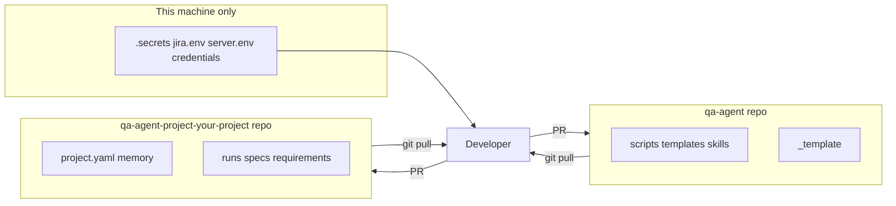

# QA Agent — setup and start

Step-by-step guide to go from a fresh clone to your first QA run (or continuous loop).
For machine-level dependencies (Python, global skills, MCP), see **`HOST_SETUP.md`** first.

---

## Overview — what you configure

| Layer | File(s) | What it controls |
|-------|---------|------------------|
| **Tracked config** | `projects/<slug>/project.yaml` | App name, URL, roles, Jira on/off, server autostart |
| **Secrets (gitignored)** | `projects/<slug>/.secrets/jira.env` | Jira site, API token, epic, board, sprint fields |
| | `projects/<slug>/.secrets/server.env` | Local app start/stop, optional STG URL, git worktree |
| | `projects/<slug>/.secrets/credentials.json` | Test user passwords per role |
| **Agent memory** | `projects/<slug>/project-memory.md` | Epic scope JQL, loop cadence, quirks, coverage ledger |

Nothing sensitive goes in `project.yaml` — only in `.secrets/`.

> **Example slug:** docs use `your-project` (valid for `new_project.sh`: lowercase letters, digits, hyphens).

---

## 1. Clone and verify the engine

```bash
git clone https://github.com/maksymbugaiov/qa-agent.git
cd qa-agent

pip install python-docx requests
bash tests/run_tests.sh    # must exit 0
```

Complete **`HOST_SETUP.md`** (global QA skills + browser MCP) before running engagements.

---

## 2. Open the right Cursor workspace

| Option | How |
|--------|-----|
| **Recommended** | Open the `qa-agent/` folder as the Cursor workspace |
| App + QA siblings | Open the parent folder containing both `myapp/` and `qa-agent/` |
| Symlink engine rules into app repo | `ln -s ../qa-agent/.cursor .cursor` inside the app workspace |

**Cursor settings to check:**

1. **Browser MCP** — enable one live-browser MCP (never headless for manual QA):
   - `cursor-ide-browser` (built-in), or
   - `user-playwright` (external)
   Record the choice in `project-memory.md` → `## App profile` → **Browser MCP**.

2. **Global QA skills** — install under `~/.cursor/skills/`:
   - `qa-site-analysis`
   - `qa-test-execution`
   - `qa-report-generation`

3. **Engine rules/skills** — active automatically when the workspace includes `qa-agent/` (rules use `globs: qa-agent/**`).

---

## 3. Create a project (once per app)

```bash
scripts/new_project.sh <slug> <base_url> "<Display Name>"

# Example:
scripts/new_project.sh myapp https://staging.myapp.com "My App"
```

This copies `projects/_template/` → `projects/<slug>/` and fills `project.yaml` placeholders.

---

## 4. Adjust `project.yaml`

Edit `projects/<slug>/project.yaml`:

```yaml
name: "My App"
slug: "myapp"
base_url: https://staging.myapp.com    # primary URL the agent tests against

environment:
  type: staging                         # staging | production | local
  notes: >
    Feature flags, rate limits, anything environment-specific.

server:
  manage: false                         # true = agent may start/stop app via server_ctl.sh

roles:
  - id: guest
    description: Unauthenticated visitor
  - id: user
    description: Standard logged-in user
  - id: admin
    description: Administrator

credentials_file: .secrets/credentials.json

jira:
  enabled: false                        # flip to true after jira.env is filled
  default_labels: [qa-agent, myapp]
  set_priority_from_severity: false     # true only if your Jira allows priority edits
```

| Setting | When to change |
|---------|----------------|
| `base_url` | Staging/prod URL you test against (no secrets here) |
| `server.manage: true` | Agent should autostart the app from `server.env` before testing |
| `server.manage: false` | App is already running (staging URL only) — agent never starts/stops it |
| `jira.enabled: true` | Only after `.secrets/jira.env` has real credentials + epic |
| `default_labels` | Add your product slug so Jira tickets are filterable |

---

## 5. Credentials — test users

```bash
cp projects/<slug>/.secrets/credentials.json.example \
   projects/<slug>/.secrets/credentials.json
```

Edit `credentials.json`:

```json
{
  "roles": {
    "guest": {},
    "user": { "username": "qa@example.com", "password": "your-test-password" },
    "admin": { "username": "admin@example.com", "password": "your-admin-password" }
  }
}
```

Add extra roles if your app has them (e.g. `manager`, `lab_manager`). Playwright helpers in
`automation/helpers/auth.js` (copied from `auth.js.example`) load this file.

**Never commit** `.secrets/credentials.json` — it is gitignored.

---

## 6. Jira — connection, epic, and field discovery

### 6a. Create an API token

1. Go to https://id.atlassian.com/manage-profile/security/api-tokens
2. Create a token for the Jira account the QA agent will use

### 6b. Fill `jira.env`

```bash
cp projects/<slug>/jira.env.example projects/<slug>/.secrets/jira.env
```

Minimum required fields:

```bash
JIRA_BASE_URL=https://your-company.atlassian.net
JIRA_EMAIL=you@your-company.com
JIRA_API_TOKEN=<paste-token-here>
JIRA_PROJECT_KEY=ABC
JIRA_ISSUE_TYPE=Bug
```

### 6c. Set the epic to track

All QA bugs/tasks file under one epic. Uncomment and set:

```bash
JIRA_EPIC_FOR_TASKS_BUGS=https://your-company.atlassian.net/browse/ABC-123
```

| Jira project type | Epic linking |
|-------------------|--------------|
| **Team-managed** | `JIRA_EPIC_FOR_TASKS_BUGS` — tickets use `parent` = epic key |
| **Company-managed** | May need `JIRA_EPIC_LINK_FIELD=customfield_10014` instead (discover id in Jira admin) |

The **continuous QA loop** retests tickets under this epic. Scope JQL (in `project-memory.md`) typically:

```text
parent = ABC-123 AND status in ("In Progress", "Validate/Testing")
```

Adjust status names to match your Jira workflow.

### 6d. Discover board, sprint, and story-point fields

```bash
python3 scripts/jira_discover.py <slug>
```

Paste the printed values into `.secrets/jira.env`:

```bash
JIRA_ASSIGNEE_ACCOUNT_ID=712020:...
JIRA_BOARD_ID=151
JIRA_SPRINT_FIELD=customfield_10020
JIRA_STORYPOINTS_FIELD=customfield_10033
```

### 6e. Verify and enable

```bash
./scripts/jira_status.sh <slug>    # should print: active
```

Then in `project.yaml`:

```yaml
jira:
  enabled: true
```

**Jira-free mode:** leave `jira.enabled: false` or omit `jira.env` — the agent runs local QA only;
`create_jira_issue.py` no-ops without error.

---

## 7. Server — local app autostart (optional)

Skip this section if you only test a remote staging URL (`server.manage: false`).

```bash
cp projects/<slug>/server.env.example projects/<slug>/.secrets/server.env
```

Basic local dev:

```bash
SERVER_URL=http://localhost:3000
SERVER_CWD=/abs/path/to/your/app/repo
SERVER_START="npm run dev"
SERVER_READY_TIMEOUT=90
```

Set `server.manage: true` in `project.yaml`.

### Isolated git worktree (recommended for QA)

Test `origin/main` without touching the developer's working directory:

```bash
SERVER_URL=http://localhost:3100          # dedicated port — avoid collision with dev :3000
SERVER_CWD=/abs/path/to/.qa-worktrees/<slug>-main
SERVER_GIT_SYNC=main
SERVER_GIT_SRC_REPO=/abs/path/to/your/app/repo
SERVER_GIT_WORKTREE=/abs/path/to/.qa-worktrees/<slug>-main
SERVER_ENV_SRC=/abs/path/to/your/app/repo/.env
SERVER_BOOTSTRAP="npm install --silent && <db setup + seed commands>"
SERVER_START="npm run dev -- -p 3100"
```

Verify:

```bash
./scripts/server_ctl.sh <slug> status   # DOWN | UP (agent) | UP (external)
./scripts/server_ctl.sh <slug> up       # start if needed
./scripts/server_ctl.sh <slug> down     # stop only if agent started it
```

### STG buildId gate (continuous loop / L5 auto-Done)

For unattended loops that auto-close `Validate/Testing` tickets only after STG deploys:

```bash
STG_URL=https://staging.your-app.com
STG_HEALTH_PATH=/api/health             # endpoint returning { "buildId": "<git-sha>" }
```

Check before auto-Done:

```bash
./scripts/stg_buildid.sh <slug> <merge-sha>
```

---

## 8. `project-memory.md` — epic scope and loop

The agent reads this file at the **start of every engagement**. Fill in before your first run.

### Required for any run

```markdown
## App profile
- **URL(s)**: https://staging.myapp.com (and local :3100 if used)
- **Stack hints**: Next.js, email/password auth, …
- **Roles / personas**: guest = public pages; user = …; admin = …
- **Browser MCP**: cursor-ide-browser
```

### Required for continuous QA loop

```markdown
## Active loop
- **Current run:** `runs/<YYYY-MM-DD>-exploratory-<task>/` (create with new_run.sh first)
- **Cadence:** 3600s (1h) — matches `/loop 3600 AGENT_LOOP_WAKE_<slug>qa`
- **Scope JQL:** `parent = ABC-123 AND status in ("In Progress", "Validate/Testing")`
- **On Hold / skip:** ABC-99, ABC-100   # tickets or infra you never auto-close
- **Last known scope:** empty
```

| Field | Purpose |
|-------|---------|
| **Scope JQL** | Which Jira tickets the loop retests each tick |
| **Epic key** | Same epic as `JIRA_EPIC_FOR_TASKS_BUGS` (e.g. `ABC-123`) |
| **On Hold** | Tickets the loop must never auto-Done (prod deploy, blocked infra) |
| **Cadence** | How often the background timer fires (seconds) |

---

## 9. Add requirements

At least one source the agent can derive `REQ-*` from:

```bash
# Option A — drop a file
cp acceptance-criteria.md projects/<slug>/requirements/requirements.md

# Option B — paste in Cursor chat:
# "Save these requirements to projects/myapp/requirements/requirements.md"
```

---

## 10. Start QA

### One-off engagement (smoke, targeted, full, …)

```bash
scripts/new_run.sh <slug> <type> "<task title>"

# Examples:
scripts/new_run.sh myapp smoke "post-deploy sanity"
scripts/new_run.sh myapp exploratory "checkout flow"
scripts/new_run.sh myapp full "release 2.4 acceptance"
```

Then in **Cursor Agent chat**:

> Run a **smoke** test on `projects/myapp` — scope is in the new run folder.

Or be specific:

> Read `projects/myapp/project-memory.md`, execute the scope in
> `projects/myapp/runs/<date>-smoke-post-deploy-sanity/` per AGENTS.md phases 0–10.

### Continuous QA loop (Jira retest + exploratory each tick)

1. Create a loop run folder:

   ```bash
   scripts/new_run.sh <slug> exploratory "continuous loop"
   ```

2. Point `project-memory.md` → `## Active loop` → **Current run** at that folder.

3. In **Agent chat** (not Terminal):

   ```
   /loop 3600 AGENT_LOOP_WAKE_myappqa
   ```

   | Part | Meaning |
   |------|---------|
   | `3600` | Interval in seconds (1 hour) |
   | `AGENT_LOOP_WAKE_myappqa` | Unique sentinel — use `<slug>qa` pattern |

4. **Stop the loop:** ask the agent *"stop all loops for qa-agent"*.

Each tick: retest Jira scope → fresh exploratory slice → security slice → update `run.md` + `project-memory.md`.

---

## 11. Pre-flight checklist

Run before your first real engagement:

```bash
# Engine healthy
bash tests/run_tests.sh

# Project exists
ls projects/<slug>/project.yaml

# Jira (if enabled)
./scripts/jira_status.sh <slug>          # active

# Server (if manage: true)
./scripts/server_ctl.sh <slug> status

# STG gate (if using auto-Done)
./scripts/stg_buildid.sh <slug> <sha>    # or exits 3 if STG_URL unset — expected

# Credentials present (manual check)
test -f projects/<slug>/.secrets/credentials.json && echo "creds ok"
```

---

## 12. Settings reference — quick lookup

### `project.yaml`

| Key | Values | Notes |
|-----|--------|-------|
| `base_url` | URL | What the agent navigates to |
| `server.manage` | `true` / `false` | Autostart via `server_ctl.sh` |
| `jira.enabled` | `true` / `false` | Gate for all Jira scripts |
| `jira.default_labels` | list | Applied to every filed ticket |
| `credentials_file` | path | Always `.secrets/credentials.json` |

### `.secrets/jira.env`

| Key | Required | Notes |
|-----|----------|-------|
| `JIRA_BASE_URL` | yes | `https://<site>.atlassian.net` |
| `JIRA_EMAIL` | yes | Account that owns the API token |
| `JIRA_API_TOKEN` | yes | From Atlassian account settings |
| `JIRA_PROJECT_KEY` | yes | e.g. `ABC`, `RQ` |
| `JIRA_ISSUE_TYPE` | yes | Usually `Bug`; use `Task` for factory work |
| `JIRA_EPIC_FOR_TASKS_BUGS` | loop + filing | Epic URL — **the epic to track** |
| `JIRA_ASSIGNEE_ACCOUNT_ID` | recommended | From `jira_discover.py` |
| `JIRA_BOARD_ID` | recommended | For active sprint assignment |
| `JIRA_SPRINT_FIELD` | recommended | Usually `customfield_10020` |
| `JIRA_STORYPOINTS_FIELD` | optional | Severity → points mapping |

### `.secrets/server.env`

| Key | Required | Notes |
|-----|----------|-------|
| `SERVER_URL` | if manage | Health-check URL |
| `SERVER_CWD` | if manage | Where to run `SERVER_START` |
| `SERVER_START` | if manage | Quoted command |
| `SERVER_GIT_SYNC` | optional | Branch for isolated worktree |
| `STG_URL` | loop auto-Done | Live staging host |
| `STG_HEALTH_PATH` | loop auto-Done | Default `/api/health` |

---

## 13. Multi-project — link without symlinks

You do **not** need `ln -s`. Use **`git submodule`** or **`git clone`** so `projects/<slug>/` is a real git repo.

### Submodule (pins version in engine)

```bash
cd qa-agent
git submodule add https://github.com/your-org/qa-agent-project-your-project.git projects/your-project
git submodule update --init
```

Clone engine with all projects:

```bash
git clone --recurse-submodules https://github.com/maksymbugaiov/qa-agent.git
```

### Plain clone into `projects/<slug>/`

```bash
cd qa-agent/projects
git clone https://github.com/your-org/qa-agent-project-your-project.git your-project
```

Scripts work the same — they only care that `projects/your-project/project.yaml` exists.

### Repo layout

The **project git repo root** should match `projects/<slug>/` ( `project.yaml` at repo root ).
If your repo wraps an extra folder (e.g. `wrapper/your-project/project.yaml`), publish a repo from the inner
`your-project/` tree or see **`PORTABILITY.md`** → *Splitting repos*.

### Secrets after clone

`.secrets/` is never in git. After clone/submodule, copy examples locally:

```bash
cp projects/your-project/jira.env.example projects/your-project/.secrets/jira.env
cp projects/your-project/server.env.example projects/your-project/.secrets/server.env
cp projects/your-project/.secrets/credentials.json.example projects/your-project/.secrets/credentials.json
# fill in real values — never commit
```

### Symlink (optional)

```bash
ln -s ../../path/to/your-project qa-agent/projects/your-project
```

Each app gets its own `projects/<slug>/` with separate `.secrets/` — projects never share Jira creds or URLs.

Full patterns: **`PORTABILITY.md`**.

---

## 14. New machine — engine + your project (two repos)

Typical layout after split:

```
qa-agent/                    ← engine (public) — scripts, skills, templates
  projects/
    _template/
    your-project/            ← project repo (private submodule or clone)
      project.yaml
      project-memory.md
      runs/ …
      .secrets/              ← local only, never in git
```

### One-time bootstrap

**1. Host tools** (once per machine) — see **`HOST_SETUP.md`**:
- Python + `python-docx` + `requests`
- Global skills: `qa-site-analysis`, `qa-test-execution`, `qa-report-generation`
- Browser MCP in Cursor

**2. Clone engine + attach your project**

Recommended (submodule — engine records which project commit you use):

```bash
git clone https://github.com/maksymbugaiov/qa-agent.git
cd qa-agent
git submodule add https://github.com/your-org/qa-agent-project-your-project.git projects/your-project
git submodule update --init
```

Or plain clone (simpler, no SHA pin in engine):

```bash
git clone https://github.com/maksymbugaiov/qa-agent.git
cd qa-agent/projects
git clone https://github.com/your-org/qa-agent-project-your-project.git your-project
```

**3. Open Cursor** on the `qa-agent/` folder. Engine rules in `.cursor/rules/` apply to
`scripts/`, `projects/`, and related paths (standalone repo layout).

**4. Secrets** — not in either repo. Copy from examples and fill locally:

```bash
cp projects/your-project/jira.env.example projects/your-project/.secrets/jira.env
cp projects/your-project/server.env.example projects/your-project/.secrets/server.env
cp projects/your-project/.secrets/credentials.json.example projects/your-project/.secrets/credentials.json
# Paste API token, passwords, machine paths (SERVER_CWD, worktree paths)
python3 scripts/jira_discover.py your-project
./scripts/jira_status.sh your-project    # active
```

Share secrets via your team vault (1Password, etc.) — not Slack/git.

**5. Verify**

```bash
bash tests/run_tests.sh
./scripts/jira_status.sh your-project
./scripts/server_ctl.sh your-project status   # if server.manage: true
```

### Day-to-day — where to commit

| You changed… | Commit to… | Example |
|--------------|--------------|---------|
| Engine script, skill, template | **`qa-agent`** | `scripts/run_automation.sh`, `qa-loop/SKILL.md` |
| Project requirements, runs, memory, specs | **`qa-agent-project-your-project`** (`projects/your-project/`) | `project-memory.md`, `automation/specs/` |
| `.secrets/*` | **Never commit** | local only |

```bash
# Project work (inside nested repo)
cd projects/your-project
git checkout -b feature/update-memory
# edit project-memory.md, runs/, etc.
git add -A && git commit -m "Update your-project coverage ledger after sprint X"
git push -u origin HEAD
# open PR on qa-agent-project-your-project repo

# Engine work (engine repo root)
cd ../..   # qa-agent root
git checkout -b fix/run-automation-default-url
# edit scripts/, .cursor/, templates/
git add -A && git commit -m "Read SERVER_URL from server.env in run_automation"
git push -u origin HEAD
# open PR on qa-agent repo
```

### Pulling updates on a new machine (or each morning)

```bash
# Engine updates (new scripts, skills, templates)
cd qa-agent
git pull

# Project updates (runs, memory, specs from teammates)
cd projects/your-project
git pull

# If using submodule from engine root:
git submodule update --remote projects/your-project   # optional: track latest project main
```

After engine pull, sanity-check:

```bash
cd qa-agent && bash tests/run_tests.sh
```

### Who owns what



- **Engine** — shared QA machinery; everyone benefits from `git pull`.
- **Project** — per-app state (memory, runs, specs); each product has its own repo.
- **Secrets** — per developer machine (or CI); never merged via git.

### Adding a second product later

```bash
cd qa-agent
git submodule add https://github.com/your-org/qa-agent-project-fwdays.git projects/fwdays
# same secrets + SETUP.md flow for projects/fwdays/
```

Engine stays one clone; each app adds one folder under `projects/<slug>/`.

---

## Related docs

| Doc | When to read |
|-----|--------------|
| **`HOST_SETUP.md`** | Machine setup: Python, global skills, MCP |
| **`AGENTS.md`** | Full QA loop phases and hard rules |
| **`PORTABILITY.md`** | Engine vs per-project repo split |
| **`.cursor/skills/qa-loop/SKILL.md`** | Continuous loop tick details |
| **`.cursor/skills/qa-jira/SKILL.md`** | Jira filing, auto-Done, recordings |
